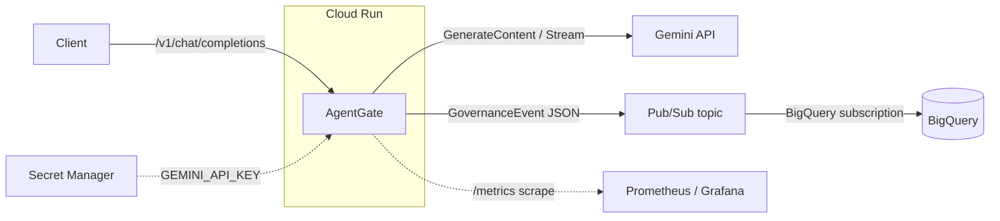

# AgentGate

A Gemini-first policy gateway in Go. Sits between your application and the Gemini API, evaluates responses for PII before they reach users, and emits structured governance events into BigQuery for audit and analytics — all on Cloud Run, deployed via Terraform + GitHub Actions WIF, with no static credentials anywhere in the pipeline.

[](https://github.com/artaoheed/agentgate/actions/workflows/ci.yml)
[](https://github.com/artaoheed/agentgate/actions/workflows/deploy.yml)
[](https://github.com/artaoheed/agentgate/actions/workflows/terraform.yml)

---

## Architecture



Three core paths:
- **Hot path** — chat request in, Gemini response out, PII evaluated *before* the response leaves the gateway. Aborts on email, redacts on phone number, allows everything else.
- **Async governance path** — every decision becomes a structured `GovernanceEvent` published to Pub/Sub, then sunk into BigQuery for SQL-based audit.
- **Observability path** — Prometheus `/metrics` endpoint, structured JSON logs to Cloud Logging.

---

## Quick Start (local)

Two ways to provide the Gemini API key:

**Option A — direct env var** (simplest):

```bash
export GEMINI_API_KEY=...                # from Google AI Studio
export GOOGLE_CLOUD_PROJECT=your-project # optional; defaults to "agent-gate"
go run ./cmd/server
```

**Option B — fetch from Secret Manager** (no key in your shell history):

```bash
gcloud auth application-default login
export GEMINI_API_KEY_SECRET=projects/agent-gate/secrets/gemini-api-key/versions/latest
export GOOGLE_CLOUD_PROJECT=agent-gate
go run ./cmd/server
```

The app prefers `GEMINI_API_KEY` if set, otherwise falls back to fetching the secret named in `GEMINI_API_KEY_SECRET`. Cloud Run uses Option A automatically because Terraform mounts the secret value as `GEMINI_API_KEY`.

Then:

```bash
curl -s localhost:8080/v1/chat/completions \
  -H 'Content-Type: application/json' \
  -d '{"messages":[{"role":"user","content":"say hi"}]}'
```

Add `"stream": true` for SSE.

## Deploy

```bash
cd infra/bootstrap && terraform init && terraform apply   # one-time state bucket
cd ../terraform   && terraform init -backend-config="bucket=$PROJECT-agentgate-tfstate" && terraform apply
echo -n "$GEMINI_API_KEY" | gcloud secrets versions add gemini-api-key --data-file=-
curl "$(terraform output -raw cloud_run_url)/livez"
```

Full Terraform walkthrough: [`infra/README.md`](infra/README.md). CI/CD wiring (Workload Identity Federation, repo variables): [`.github/README.md`](.github/README.md). Ops procedures: [`docs/RUNBOOK.md`](docs/RUNBOOK.md).

---

## Shipped Today

### 🔐 Response-side PII enforcement
- Email → **Abort** (`HTTP 403` non-streaming, `data: [BLOCKED]` streaming).
- Phone → **Redact** (in-place `*` mask non-streaming, `data: [REDACTED]` streaming).
- Rolling 300-char window so matches that span chunk boundaries are caught mid-stream.
- Per-chunk evaluation so short payloads can't slip through (the chunk carrying the digits is suppressed even if Gemini sent everything in one frame).
- Matched spans are masked in the buffer so a single hit doesn't re-fire on the next eval.

### ⚡ Streaming gateway
- OpenAI-compatible `/v1/chat/completions` shape (request + response).
- SSE streaming passthrough with `<-ctx.Done()` client-disconnect handling.

### 📊 Governance event pipeline
- `GovernanceEvent` (request ID, model, policy, decision, reason, latency, streaming flag).
- Multi-emitter: structured slog + Prometheus counter + Pub/Sub topic.
- Pub/Sub → BigQuery subscription writes events straight into a partitioned table (`governance_events_schema.json` is the single source of truth shared with the Go struct).

### 🛠 Operability
- `/livez` (liveness), `/readyz` (atomic-gated startup), `/metrics` (Prometheus). Liveness is `/livez` rather than the conventional `/healthz` because Google's edge intercepts `/healthz` on the default `*.run.app` domain.
- Graceful shutdown on SIGINT/SIGTERM; flushes the Pub/Sub publisher on exit.
- Structured JSON logs (`log/slog`); every per-request line carries `request_id`.

### 🏗 Infrastructure as Code
- Full GCP stack provisioned via Terraform: Cloud Run, Pub/Sub, BigQuery, Secret Manager, Artifact Registry, IAM, WIF.
- Bootstrap module for the state bucket so the whole thing is reproducible from zero.

### 🚀 CI/CD
- **`ci.yml`** — gofmt, go vet, staticcheck, race-enabled tests + coverage, Trivy CRITICAL/HIGH image scan.
- **`deploy.yml`** — WIF-authenticated build → push to Artifact Registry → Cloud Run revision → smoke test `/livez`. No static credentials in GitHub.
- **`terraform.yml`** — fmt + validate on every infra PR.

---

## Observability

The five metric families exposed at `/metrics`:

| Metric | Labels | Use |
|---|---|---|
| `agentgate_requests_total` | path, method, status | request volume + error rate |
| `agentgate_request_duration_seconds` | path | p95/p99 latency |
| `agentgate_governance_decisions_total` | policy, decision, reason | policy effectiveness, regex tuning |
| `agentgate_gemini_requests_total` | model, mode, outcome | upstream health |
| `agentgate_gemini_duration_seconds` | model, mode | upstream latency |

Sample PromQL:

```promql
# Request error rate
sum(rate(agentgate_requests_total{status=~"5.."}[5m]))
/ sum(rate(agentgate_requests_total[5m]))

# p95 gateway latency on the chat endpoint
histogram_quantile(0.95,
  sum by (le) (rate(agentgate_request_duration_seconds_bucket{path="/v1/chat/completions"}[5m])))

# PII blocks per minute
sum by (reason) (rate(agentgate_governance_decisions_total{decision="abort"}[1m])) * 60
```

Importable Grafana dashboard: [`docs/dashboards/agentgate.json`](docs/dashboards/agentgate.json).

---

## Security Posture

| Concern | Approach |
|---|---|
| Container | Distroless base (`gcr.io/distroless/base-debian12`), static binary, no shell |
| Identity | Runtime SA dedicated to Cloud Run, separate CI/CD SA, no project-wide Editor |
| Secrets | `GEMINI_API_KEY` mounted from Secret Manager via `secret_key_ref`; never in env, never in image |
| CI auth | Workload Identity Federation (OIDC) — no JSON keys in GitHub secrets |
| IAM bindings | Resource-scoped where possible (`pubsub_topic_iam_member`, `secret_manager_secret_iam_member`) instead of project-wide |
| Image | Trivy scan in CI fails on unmitigated CRITICAL/HIGH |
| Network | Cloud Run TLS-terminated by default; public invoke gated behind a Terraform variable so it can be flipped off when auth is added |

---

## Cost (back-of-envelope, 1M requests/month, Gemini Flash)

| Component | Cost |
|---|---|
| Cloud Run (1 vCPU, 512Mi, ~100ms p50) | ~$5 |
| Gemini 2.5 Flash (avg 200 in / 300 out tokens) | ~$60 |
| Pub/Sub (1M messages × ~250B) | $0 (within 10GB free tier) |
| BigQuery storage (~250MB) + scans | $0 (within free tier) |
| Artifact Registry (10 images × ~50MB) | <$0.01 |
| Secret Manager (1 secret × 6 accesses/hr) | $0 (within free tier) |
| State bucket | ~$0.02 |
| **Total** | **~$65/mo, ~95% of which is Gemini tokens** |

At demo / portfolio volume (a few hundred requests/day) the GCP side is essentially $0.

---

## Roadmap (Tier 2+)

Honest about what's not yet built:

- **Prompt-side validation** — today only model responses are evaluated; user prompts pass through unchecked.
- **Custom policy hooks (sync + async)** — the policy layer is one hardcoded PII evaluator. A pluggable `Hook` interface would let teams add their own evaluators without forking.
- **Semantic caching** — embedding-based response cache (Redis / vector backend) to cut cost on repeated queries.
- **Modular middleware chain** — the handler is a single inline function; composable middleware would make auth, rate limiting, and metrics first-class.
- **Distributed tracing** — OpenTelemetry deps are pulled but not wired.
- **SLOs + alert policies** — once metrics have a few weeks of baseline.
- **Auth on `/v1/chat/completions`** — currently public; needs at minimum an API-key check or IAP integration.
- **Rate limiting** — none today.
- **Load test in CI** — k6 or hey with results in README.
- **Real `terraform plan` in PRs** — needs a separate read-only infra SA (see [`.github/README.md`](.github/README.md)).

---

## Layout

```
.
├── cmd/server/          # HTTP server entrypoint
├── internal/
│   ├── policy/          # PII evaluator + rolling window
│   ├── gemini/          # thin wrapper over generative-ai-go
│   ├── events/          # GovernanceEvent + log/pubsub/metrics emitters
│   ├── secrets/         # Secret Manager fetch helper
│   └── obs/             # Prometheus metrics + slog setup
├── api/                 # OpenAI-shaped request/response types
├── infra/
│   ├── bootstrap/       # state bucket (run once)
│   └── terraform/       # main stack (Cloud Run, Pub/Sub, BigQuery, IAM, WIF, ...)
├── docs/
│   ├── RUNBOOK.md       # ops procedures
│   └── dashboards/      # importable Grafana JSON
├── .github/workflows/   # CI / deploy / terraform validate
├── Dockerfile           # distroless multi-stage build
└── governance_events_schema.json   # shared by Go struct + BQ table
```

---

## License

[MIT](LICENSE).
